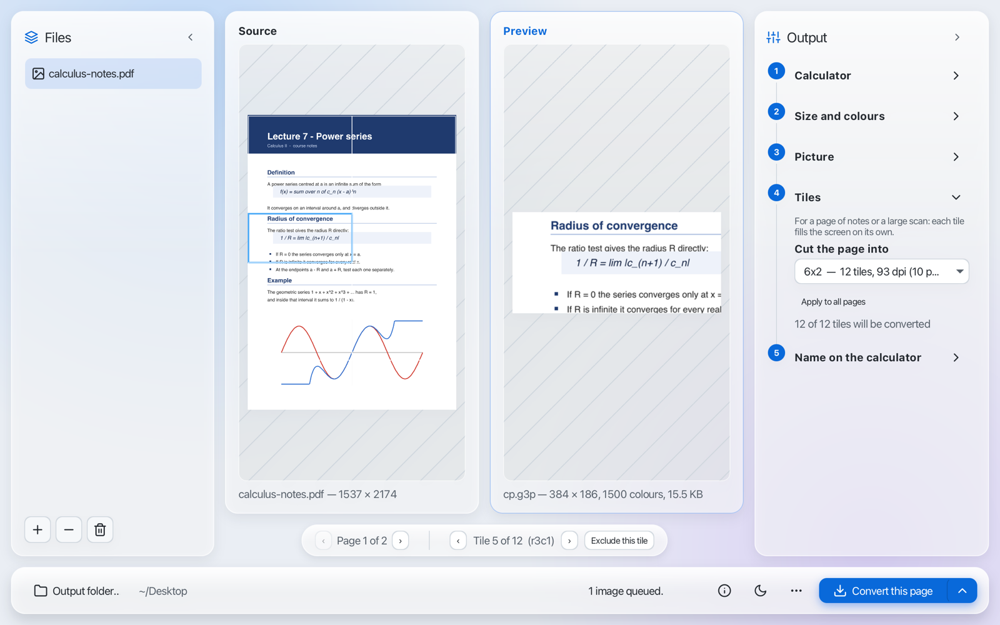
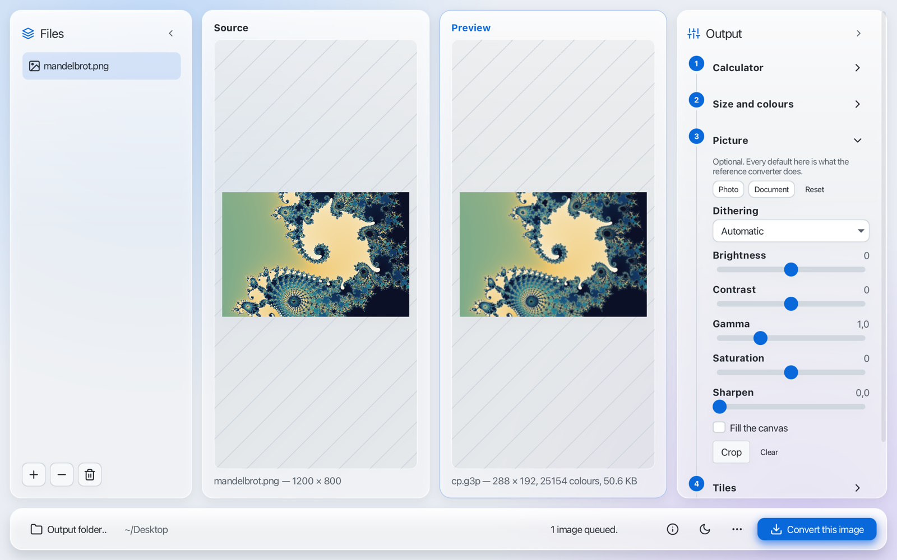
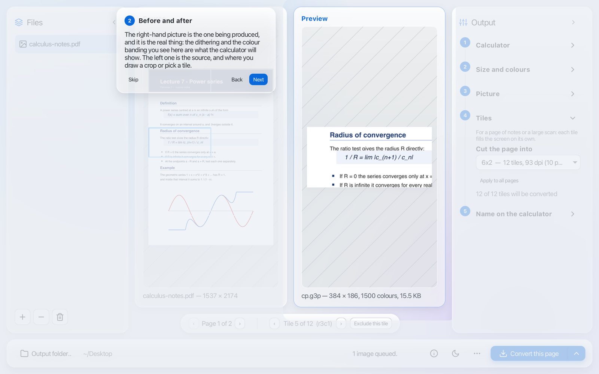

# Using the app

A walk through the window, from dropping a file in to writing it out.
[← Back to the README](../README.md)

<picture>
  <source media="(prefers-color-scheme: dark)" srcset="screenshots/tiles-dark.png">
  
</picture>

## Getting files in

Drop images or a PDF anywhere on the window — it says **Drop to add** while you drag — or click the
empty list to choose them. Once the list has files in it, **+** adds more, **−** removes the
selected ones and the bin empties it. PNG, JPEG, GIF, BMP, WebP, TIFF and PDF are all read.

The first file added is selected, and the previews and the panel on the right follow whichever file
is selected.

## The two previews

**Source** is the file as it is. **Preview** is what the calculator will get: not a scaled-down copy,
but the preprocessed image the encoder is about to write, so the dithering and the colour banding are
there to judge before any file exists. Under it are the format, the size in pixels, the number of
colours and the size of the file — and a warning when the file will be too big for the calculator to
take.

## The five steps

The **Output** panel asks its questions in the order a conversion happens. One step is open at a
time: click a step's title to open it, or scroll over the panel to move from one step to the next.
A step that does not apply to the selected file is dimmed and cannot be opened, and until a file is
added only the first one is available.

1. **Calculator** — the **Mode**, **Picture file** or **Python script**; the **Calculator** model;
   and the **Format** it takes.
2. **Size and colours** — the **Canvas**, which is the calculator's screen, with presets that fill
   it exactly; the number of **Colours**; **Keep aspect ratio** and **Enlarge smaller images**.
3. **Picture** — optional, and every default here is what the reference converter does. **Photo**
   and **Document** set the controls below as a starting point — **Document** turns dithering off
   and hardens the contrast, which is what text and screenshots need — and **Reset** puts them back.
   Then **Dithering**, **Brightness**, **Contrast**, **Gamma**, **Saturation** and **Sharpen**.
   **Fill the canvas** crops to the screen's proportions instead of padding with white, and
   **Crop** lets you draw on the source the part to convert; **Clear** removes it.
4. **Tiles** — for a page of notes or a large scan, [below](#a-document-in-tiles). Dimmed for a
   file that already fits the screen in one piece.
5. **Name on the calculator** — the **On-calculator name**, or the **Slot number** on models that
   address pictures by number. The line underneath says which of the two applies, and how the
   calculator will show it.

<picture>
  <source media="(prefers-color-scheme: dark)" srcset="screenshots/photo-dark.png">
  
</picture>

## A document in tiles

A whole page on a calculator screen is unreadable, so step 4 cuts it into tiles that each fill the
screen. **Cut the page into** lists the grids that suit this page and this screen, each with its
number of tiles, the dots per inch it reaches and how tall a line of ten-point type ends up. Columns
are what buy resolution: cutting a page across only adds rows, and the text stays the size it was.

Once a grid is chosen it is drawn over the source, and a bar under the two previews steps through
the tiles while the preview shows the one you are on; clicking a cell on the source jumps straight
to it. **Exclude this tile** leaves one out — the running header nobody wants on a calculator — and
**Put this tile back** undoes it. In step 4, **Include all** brings every tile back, and **Apply to
all pages** gives every page of the document the same tiles switched off as this one.

For a document of more than one page, the same bar turns the pages, and each page keeps its own
excluded tiles. A grid and a crop both say which part of the image to use, so **Crop** is
unavailable while a grid is chosen.

## Converting

**Output folder…** picks where files are written. The button on the right says what it is about to
do — **Convert this image**, **Convert 3 images**, or **Convert this page** for a document, which
writes every included tile of the page on screen — and Enter does the same. The arrow beside it
offers **Convert every page**. The line beside the buttons then says how many files were written and
where, or what failed.

## Everything else

The **ⓘ** button opens a panel about OmniPlotter: **Take the tour** walks through the window, and at
the bottom are the version, **Check for updates** — which answers either way, including when GitHub
cannot be reached — and the **Language**: English, Italian, or **Same as the system**, taking effect
the next time the window opens. The tour also opens by itself on the first launch.

The moon button switches between light and dark. The **…** menu has the tour again, **Set up the
terminal command** — which puts `omniplotter` on your PATH, see
[Installing](installing.md#the-command-in-a-terminal) — **Open log folder**, which is what a bug
report needs, and **Animated background**. Both side panels fold away from the arrow in their title,
to leave more room for the previews.

When a newer release is out, a banner at the top of the window says so, with **Release notes**,
**Skip this version**, and a button to dismiss it.

  

